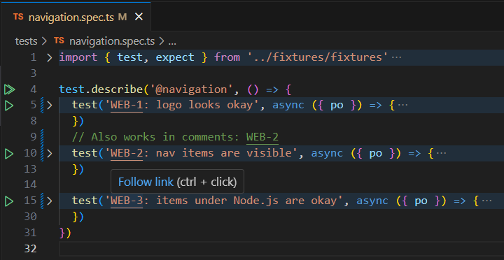

# Jira Ticket Linker for Test

Simple Visual Studio Code extension to make Jira links in `markdown`, `javascript` and `typescript` files "alive" (so you can click them and navigate to the issue in your default web browser). 

The intended use of this extension is to help QA Automation Engineers easily couple automation scripts and test cases described in Jira, but it can work for various other Test Management Systems having similar url structure as Jira (`https://jira.atlassian.com/browse/ECO-1234`)

### Setup
Just add `jira.config` to your Visual Studio Code settings, like in the example below. Note that you can add multiple configurations.
If `delimeter` configuration parameter is not specified, dash `-` will be assumed
```json
{
  "jira.config": [
    {
      // Example: https://jira.atlassian.com/browse/ECO-22
      "code": "ECO",
      "url": "https://jira.atlassian.com/browse/"
    },
    {
      // Example: https://github.com/danilo-vasojevic/jira-ticket-linker-for-test/issues/2
      "code": "issues",
      "delimeter": "/", // Optional. Defaults to '-'
      "url": "https://github.com/danilo-vasojevic/jira-ticket-linker-for-test/"
    }
  ]
}
```

### Enjoy
Now wherever you open a `javascript`, `typescript` or `markdown` file, extension will look for JIRA issue ids (e.g. `ECO-1234`), and create links from them using `url` as prefix. You can navigate to newly created links and save a bit of time.

#### Example

